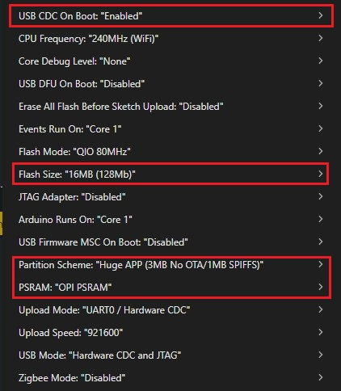

# ESP32 YOLO Object Detection Server

A FastAPI server that receives images from ESP32 camera and performs YOLO object detection.

## Quick Start

### 1. Install Dependencies
```bash
python -m venv venv
venv\Scripts\activate  # Windows
# or
source venv/bin/activate  # Linux/Mac
pip install -r requirements.txt
```

### 2. Start Server
```bash
python start_server.py
```

The server will start on `http://<your-local-ip>:8000`

## Endpoints

- `/health` - Health check
- `/yolo-detect` - YOLO object detection (POST)
- `/upload-image` - Save images (POST)

## ESP32 Setup

### Arduino IDE Configuration

**⚠️ IMPORTANT: Board Selection**
- **Board**: `ESP32S3 Dev Module` (not ESP32 Dev Module)
- **Tools Settings**: Configure as shown below



**Required Tools Settings:**
```
Board: "ESP32S3 Dev Module"
USB CDC On Boot: "Enabled"
CPU Frequency: "240MHz (WiFi)"
Core Debug Level: "None"
USB DFU On Boot: "Disabled"
Erase All Flash Before Sketch Upload: "Disabled"
Events Run On: "Core 1"
Flash Mode: "QIO 80MHz"
Flash Size: "4MB (32Mb)"
JTAG Adapter: "Disabled"
Arduino Runs On: "Core 1"
USB Firmware MSC On Boot: "Disabled"
Partition Scheme: "Default 4MB with spiffs (1.2MB APP/1.5MB SPIFFS)"
PSRAM: "OPI PSRAM"
Upload Mode: "UART0 / Hardware CDC"
Upload Speed: "921600"
USB Mode: "Hardware CDC and JTAG"
```

### Code Configuration

Update these values in your ESP32 sketch:
```cpp
const char* ssid = "your_wifi_name";
const char* password = "your_wifi_password"; 
const char* serverHost = "your_server_ip";  // e.g., "192.168.1.100"
```

### Hardware Requirements
- **ESP32-S3 CAM Module** with OV2640 camera
- **USB-C Cable** for programming
- **4MB Flash** with PSRAM support
- **WiFi Network** connection

## Output

ESP32 will print detected objects to Serial Monitor:
```
onion: x=286, y=135, w=191, h=201
tomato: x=150, y=200, w=120, h=110
No object found
```

Detection runs every 1 second automatically.

## Troubleshooting

### ESP32 Issues:
- ✅ Ensure **ESP32S3 Dev Module** is selected (not ESP32 Dev Module)
- ✅ Check **PSRAM** is set to "OPI PSRAM"
- ✅ Verify **Flash Size** is "4MB (32Mb)"
- ✅ Use correct **Upload Speed** (921600)
- ✅ Check WiFi credentials and server IP

### Server Issues:
- ✅ Ensure YOLO model file `best.pt` exists
- ✅ Check server is accessible from ESP32's network
- ✅ Verify port 8000 is not blocked by firewall

## API Testing

Test with curl or Postman:
```bash
# Health check
curl http://your-server-ip:8000/health

# Upload image for detection
curl -X POST -F "file=@image.jpg" http://your-server-ip:8000/yolo-detect-form
```
